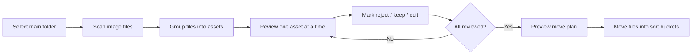

# Domain Model

This document captures the evolving model for a Lightroom-like quick sorter for RAW + JPEG image folders.

## Current Intent

The app lets a user select a main folder, review one image asset at a time, mark each asset as `reject`, `keep`, or `edit`, and then move the files into decision folders under the main folder for later import into Lightroom or another editor.

## Core Entities

### PlatformTarget

The first version targets macOS. The architecture should avoid unnecessary macOS-only assumptions where practical, but packaging and release support for Windows and Linux are deferred.

Version one distribution is local-only. Signing, notarization, and auto-update are deferred.

### ProjectTooling

Version one uses Electron Forge as the Electron scaffold/package tool, React for the renderer UI, Vite for renderer build/dev tooling, and TypeScript across main, preload, and renderer code.

### Renderer

The Electron renderer process contains the UI. Version one uses React for the renderer because the developer is familiar with React.

React is the UI framework. Vite is the build/dev tool for the renderer.

### ShootFolder

The selected folder containing source images. It is the boundary for scanning and for generated output folders unless we later choose a different destination model. The first version scans only this folder and does not recurse into subfolders.

### ImageAsset

A sortable unit shown to the user. The working assumption is that one asset can include multiple files:

- Primary RAW file.
- Matching JPEG preview.
- Optional sidecars such as `.xmp`.

Decision: RAW + JPEG files with the same basename are treated as one `ImageAsset`. The app displays only the JPEG during review for speed, while the user's decision applies to the whole grouped asset.

If a RAW file has no matching JPEG, it is still included as an `ImageAsset` and displayed through a RAW preview fallback.

If a JPEG has no matching RAW, it is included as a JPEG-only `ImageAsset` and moves by itself.

Version one supported image extensions are `.jpg`, `.jpeg`, `.cr2`, `.cr3`, `.nef`, `.arw`, `.raf`, `.rw2`, `.orf`, and `.dng`.

### AssetFile

One physical file on disk that belongs to an asset. It has a path, extension, role, size, modification time, and move status.

Files with the same basename as an asset and a recognized sidecar extension are grouped into the asset and move with it.

Version one recognizes `.xmp` as the only sidecar extension.

### PreviewCache

An app-managed cache for generated RAW previews. It lives in the app's user data/cache directory, outside the selected photo folder, and is keyed by file identity plus size and modification time.

### RawPreviewEngine

The service responsible for making RAW-only assets displayable. Version one uses ExifTool to extract embedded previews from RAW files. Full RAW decoding through LibRaw or another decoder is deferred until embedded-preview extraction is not enough.

### ReviewSession

The user's current sorting pass. It tracks the ordered asset list, the active asset, decisions, skipped items, and completion state.

The session is autosaved after each decision so the user can resume unfinished work.

The review UI includes a slim bottom filmstrip for orientation, nearby navigation, and progress.

### Filmstrip

A compact thumbnail strip at the bottom of the review UI. It shows nearby assets and decision state, supports jumping to nearby images, and keeps the main image as the dominant surface. The first version does not include a full grid view.

The filmstrip represents the whole review session, not only a small neighborhood around the current asset. It should be virtualized so large folders remain fast.

Each filmstrip item displays the asset's thumbnail image.

Marked thumbnails show the same decision icon language as the main preview. The current asset is highlighted with a thin selection outline. Filenames are not shown in the filmstrip by default.

### MetadataSidebar

A toggleable sidebar for image metadata. The first version does not need extra metadata fields beyond the minimum needed for basic review context. Metadata should not be placed in a permanent top bar or in the filmstrip.

The sidebar is hidden by default in the first version.

First-version sidebar fields:

- Filename.
- Asset type, such as `RAW+JPEG`, `RAW`, or `JPEG`.
- Current decision.
- File list in the asset group.

EXIF metadata is deferred to a later version.

### SessionFile

A small JSON recovery file stored under the selected folder as `_cullinary-session.json` in the first version. It records the selected folder identity, asset list, decisions, active position, and enough file metadata to warn when files changed since the session was saved.

After a fully successful final move, the session file is deleted. If finalization is partial, blocked, skipped, or conflicted, the session file is kept so the user can resume or resolve remaining work.

### Decision

The user's mark for an asset: `reject`, `keep`, or `edit`.

First-version decision shortcuts:

- `X` maps to `reject`.
- `P` maps to `keep`.
- `E` maps to `edit`.

After any decision shortcut, the review session automatically advances to the next asset.

First-version navigation shortcuts:

- `Left Arrow` moves to the previous asset.
- `Right Arrow` moves to the next asset.
- `Space` toggles between fit-to-view and 100% loupe/zoom preview.

The 100% loupe centers on the current cursor position when possible, otherwise on the image center.

The current decision is shown as an icon overlay in the top-right corner of the image preview. The icon remains visible when revisiting an already-marked asset.

Decision icon language:

- `reject`: red `X`.
- `keep`: green checkmark.
- `edit`: amber pencil or sliders icon.

### MovePlan

The proposed batch operation generated when the session is complete. It maps asset files to destination folders and should be reviewed before execution.

First-version destination buckets:

- `reject` decisions move to `_reject`.
- `keep` decisions move to `_keep`.
- `edit` decisions move to `_edit`.

If any destination file already exists, the move plan marks that item as conflicted and requires a user-selected resolution before it can be moved.

First-version conflict resolution choices are `skip` and `rename`; `replace` is not available.

For grouped assets, conflict resolution applies to the whole `ImageAsset` so RAW, JPEG, and sidecars are not separated accidentally.

The default rename suggestion appends `-copy-XX` to the shared basename and preserves each file extension, for example `IMG_1234-copy-02.CR3` and `IMG_1234-copy-02.JPG`.

### MoveResult

The outcome of executing a move plan, including successful moves, skipped files, conflicts, and errors.

## Proposed Invariants

- The app never edits RAW pixels or writes into RAW files.
- Version one scans only supported image extensions: `.jpg`, `.jpeg`, `.cr2`, `.cr3`, `.nef`, `.arw`, `.raf`, `.rw2`, `.orf`, and `.dng`.
- A decision applies to an `ImageAsset`, not merely to the currently displayed preview.
- Review display uses the matching JPEG when available and does not decode RAW files on the critical navigation path.
- RAW-only assets remain reviewable and use an embedded-preview-first RAW fallback.
- JPEG-only assets remain reviewable and move by themselves.
- Generated RAW previews are cached in the app user data/cache location, not in the selected photo folder.
- Version one uses ExifTool for embedded RAW preview extraction; full RAW decoding is deferred.
- `.xmp` sidecars move with the matching asset automatically.
- Folder scanning is non-recursive in the first version.
- Moves happen as an explicit batch at the end of a review session.
- Rejected assets are moved to `_reject`; the app does not delete them or send them to the OS trash.
- Review decisions are autosaved after each decision in a session file.
- The session file is deleted after fully successful finalization and kept after partial or blocked finalization.
- The app must be able to show the user what will move before executing.
- File conflicts are handled without overwriting existing files silently.
- Destination conflicts are flagged and resolved by the user before move execution.
- First-version conflict resolution allows skip or rename only.
- Conflict resolution applies to the whole asset group.
- Rename suggestions append `-copy-XX` to the shared basename while preserving extensions.
- Output folders are created only when at least one file will move into them.
- First-version keyboard controls are `X`, `P`, `E`, `Left Arrow`, `Right Arrow`, and `Space`.
- Marking an asset automatically advances to the next asset.
- `Space` toggles fit-to-view and 100% loupe/zoom preview.
- Marked assets show a decision icon overlay in the top-right corner of the image preview.
- Decision icons use red `X`, green checkmark, and amber pencil/sliders language.
- The first version includes a slim bottom filmstrip, not a full grid view.
- The filmstrip represents the whole session and uses virtualization for performance.
- Filmstrip items show thumbnail images.
- Filmstrip thumbnails show decision icons and a current-image outline; filenames are hidden by default.
- Image metadata belongs in a toggleable sidebar; v1 does not require extra metadata fields.
- The metadata sidebar is hidden by default.
- The v1 metadata sidebar shows filename, asset type, current decision, and grouped files only; EXIF is deferred.
- Version one targets macOS first; Windows and Linux packaging are deferred.
- Version one distribution is local-only; signing, notarization, and auto-update are deferred.
- Version one uses React for the renderer UI.
- Version one uses Vite as the React renderer build/dev tool.
- Version one uses Electron Forge as the Electron scaffold/package tool.
- The renderer UI does not receive arbitrary filesystem access; it asks the main process through a narrow API.

## Resolved Modeling Decisions

1. RAW + JPEG files with the same basename are one sortable asset.
2. The review UI displays the JPEG preview for speed.
3. A `reject`, `keep`, or `edit` decision applies to the whole asset group, including the matching RAW file.
4. RAW files without matching JPEGs are still shown and sortable.
5. Sidecars with the same basename as an asset move automatically with that asset.
6. The first version scans only the selected folder, not subfolders.
7. Rejected assets move to `_reject` rather than being deleted or trashed.
8. In-progress review decisions are autosaved to a session file after each decision.
9. RAW-only preview generation uses embedded RAW previews first, with full RAW decoding only as fallback.
10. Generated RAW previews are cached in the app's user data/cache location.
11. JPEG-only files are sortable assets and move by themselves.
12. First-version output folders are `_reject`, `_keep`, and `_edit`.
13. Destination file conflicts are flagged and require a user decision.
14. First-version conflict choices are skip and rename only; replace is not offered.
15. Output folders are created only when needed.
16. Conflict resolution applies to the whole asset group.
17. Default rename suggestions append `-copy-XX` to the shared basename.
18. First-version keyboard controls are `X` reject, `P` keep, `E` edit, arrow navigation, and reserved `Space`.
19. Pressing `X`, `P`, or `E` marks the asset and advances to the next asset.
20. `Space` toggles between fit-to-view and 100% loupe/zoom preview.
21. Marked assets show a decision icon overlay in the top-right corner of the image preview.
22. Decision icons are red `X`, green checkmark, and amber pencil/sliders.
23. The first version includes a slim bottom filmstrip and no full grid view.
24. The filmstrip represents the whole review session and is virtualized.
25. Filmstrip items show thumbnail images.
26. Filmstrip thumbnails show decision icons and current-image selection state, with no filename labels by default.
27. Image metadata belongs in a toggleable sidebar, with no extra metadata requirements for v1.
28. The metadata sidebar is hidden by default.
29. The v1 metadata sidebar shows filename, asset type, current decision, and grouped files only; EXIF is deferred.
30. Version one recognizes `.xmp` as the only sidecar extension.
31. The session file is deleted only after fully successful finalization; partial or blocked finalization keeps it.
32. Version one targets macOS first.
33. Version one distribution is local-only.
34. Version one uses React for the renderer UI.
35. Version one uses Vite as the React renderer build/dev tool.
36. Version one uses Electron Forge as the Electron scaffold/package tool.
37. Version one uses ExifTool for embedded RAW preview extraction; LibRaw/full RAW decoding is deferred.
38. Version one supports `.jpg`, `.jpeg`, `.cr2`, `.cr3`, `.nef`, `.arw`, `.raf`, `.rw2`, `.orf`, and `.dng`.

## Open Modeling Questions

1. Which future enhancements are explicitly deferred from v1?

## Deferred Ideas

- Progress counts by decision during review, such as reviewed/total and counts for reject, keep, edit, and unmarked.
- Additional sidecar formats beyond `.xmp`.
- Windows and Linux packaging.
- Signed and notarized macOS builds.
- Auto-update.
- Full RAW decoding through LibRaw or another RAW decoder.

## Initial Workflow

